这是以前学习犀牛建模软件时候对节点的总结，但凡曲面建模都是和节点分不开的。

# 什么是最简？

控制点=阶数+1

这样的曲线叫做最简曲线，也就是说3阶4点，4阶5点，这样的曲线没有通过节点来增加额外的控制点，也是最完美最光滑的曲线。

# 什么是节点？

犀牛的一些教学视频貌似很少提到这个节点，只有控制点或者内插控制点，节点好处就是阶数不变的情况下增加曲线的控制点，坏处就是增加的曲线的复杂程度，而且在曲线节点处只能达到G2连续，换句话说节点就是把2个3阶4点的曲线通过一个G2的连续组成一个3阶5点的曲线。这样的曲线就有2个跨距。
<!--more-->
# 什么是跨距？

如图，是一条3阶5点的曲线，那么红色标出来的位置就是节点。 起点或者终点或者节点到节点的位置，称为跨距（SPAN），3阶5点的曲线就是2SPAN。

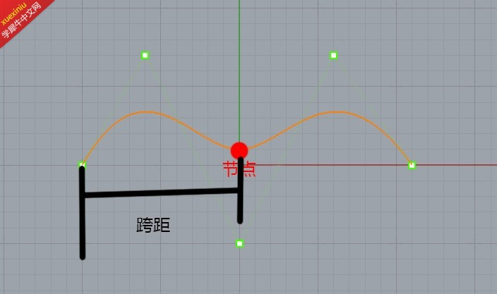

下面再来详细讲一讲怎么查看犀牛里的节点，貌似是不能直接查看，那么查看的方式也比较简单，如图，

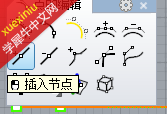

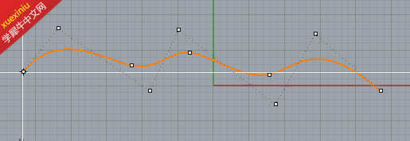

在点的编辑里点击插入节点，那么曲线上就会出现节点所在的位置了，图里的曲线3阶7点，3阶本来只有4个点，应为有3个节点的支持，使它变成7个控制点，再数数节点与节点之间的跨距，也就是4SPAN。

# 如何绘制最间曲线？

最好是在画曲线的时候，心中就应该有一个数，应该是几个点能完成，那么在画曲线的时候在命令栏输入相应的阶数来完成点数的控制

，再比如你如果想在2个曲线中间做一条过渡曲线那怎么画？这里大家应该都知道保持G1连续 需要2个控制点与上一个曲线保持在同一条线上，G2则是3个。如果在2个曲线间做一个过渡的最简线，那么G1则需要3阶4点，G2则需要5阶6点。

# 再绘制完曲线发现控制点不够怎么办？
一般最常用的大家可能会想到打开点的编辑里面的添加控制点或者节点，在这里我不推荐这种方式，因为会增加曲线的SPAN，我介绍的方法是在SPAN保持为1的情况加增加控制点，那么可能会联想到重建曲线，点数比阶数大1点不就好了，没错，这是一个方法。但是重建过的曲线变动会比较大，远远达不到我所想要的效果，在这里我推荐用的是DEG，更改阶数。

在曲线工具菜单下的DEG。可以再曲线几乎不改变的情况下增大阶数，提供更多的控制点。当然这个工具虽好，但是不建议大家超过7阶，尽量把曲线控制在8点内完成。这个方法同样适用于曲面，曲面菜单里一样有一个DEG。大家不妨试试。

# 能做1SPAN的成面工具有哪些？

这里常用的推荐大家3个，放样，双轨扫掠里的最间扫掠，还有以2,3,4条边缘建立曲面工具，这3个工具做出来的曲面质量比较好，在线没问题的情况下 都能轻松完成1SPAN曲面构建，1SPAN的构建除了工具要使用得当，曲线也很重要，。相同方向的2条曲线属性要相同，如图，一个方向是3阶4点。一个方向的是2阶3点，那么用边缘成面的工具自然是1SPAN，当然用双轨最间扫掠也能完成这个

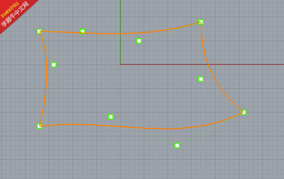

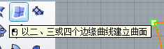

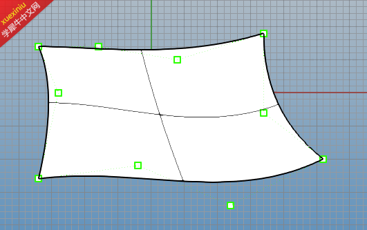

那如果我把其中一个3阶4点改为3阶5点呢？

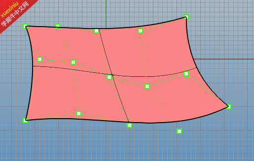

用边缘建面工具做出来的一样是1SPAN，他会用4阶5点的边缘来逼近3阶4点的那条边，以保持同方向的属性都为5点，所以这个工具做1SPAN很常用，平时自然用的很少，虽然曲线属性不同，但是他会在自动逼近另一条属性不同的线，不过逼近的毕竟是有公差所以大家最好保持曲线同方向的属性相同， 这种情况用双轨如果选错轨道是勾选不了最间扫掠的，你选择2个属性不同的线做轨道是构线不了最间的。选择相同属性的2个线做轨道就可以勾选最间，效果同上一个工具。
做1SPAN合理的分面也是相当重要，很多复杂的曲面是不可能用一个1SPAN就能做出来的，例如这样的过渡圆角，

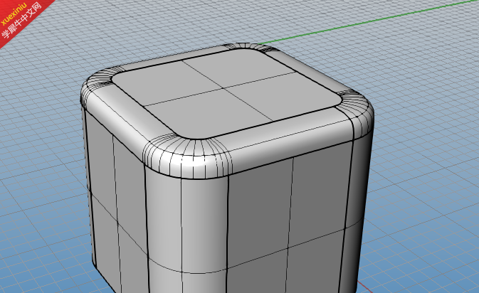
这样的曲面是没法用一个1SPAN做出来的，那么就要分面。下部分由8个曲面组成。那么我们就分8个1SPAN来构建这个过渡曲面，
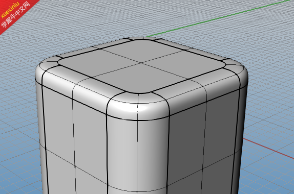
，这样曲面的ISO等参线会不会更好看呢？

# ISO线跟节点的关系

所谓ISO线，在犀牛里叫做结构线，ALIAS里叫做等参线，它其实就是曲面中的节点，ISO所在的位置也就是曲线上节点所在的位置，如果这样说起来，UV方向 3阶4点的曲线是不存在ISO线的，3阶5点的曲面会在UV方向各有一根ISO线，这也是很多入门教程里说的犀牛里ISO线越少曲面越光滑的原因。因为节点更少。SPAN更少。细心的同学也发现 犀牛里3阶4点的曲面为什么也有一条ISO线呢。理论上确实不应该有，但是为了更好的查看曲面的趋势，所以才有这一根虚拟的ISO作为参考。

# 非4边面如何构建？

曲面建模一般都是用合理的4边面来构建，为什么要这样做？我们首先画个3角面 开启他的控制点看看，
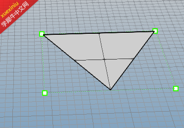 
只有一条边的控制点在三角形的边上，另外的2个都不在，这种图形也是被默认为4边面通过修剪得来的，那么在犀牛里修剪的边缘非常不好，不能匹配不能合并不能延伸，与修建边缘进行匹配的曲面只会无限的逼近那个边缘，公差越小逼近的曲面ISO则越多，曲面质量越差，这不是我们想要的结果，但是难免会出现一些3边面，5边面等，那么我改如何来构建？下图给你们答案。 

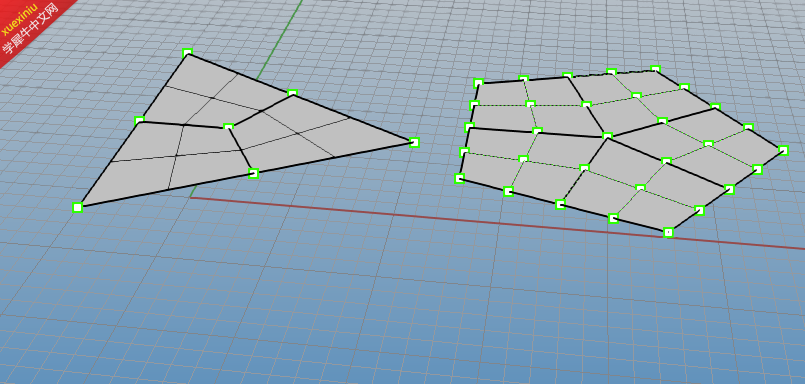
把所有的多边形拆分为若干个1SPAN的4边面来做就好了，这样的面匹配起来可以不存在公差，结构线也整齐，互相贯穿，无非是多花点时间罢了。