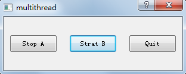
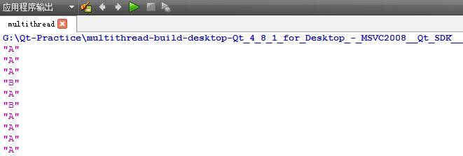
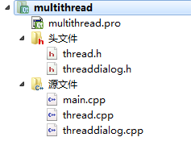
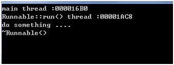
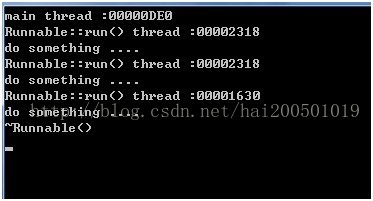
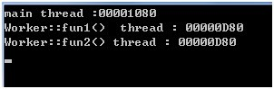
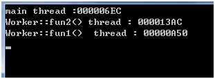
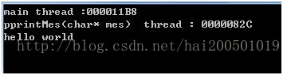

QTherd 线程（未完待续）


# 创建thread
常用的创建线程的方法有4种 分别是：
- *继承QThread*
- *继承QRunnable*
- *使用moveToThread*
- *使用QtConcurrent::run*

***重中之重：***

*由于run()可以在运行的时候直接调用exec()对线程进行死循环。*

**一定要使用moveToThread+信号槽机制，可以节省很多东西，非常方便，这个是最新的用法！！！
一定要使用moveToThread+信号槽机制，可以节省很多东西，非常方便，这个是最新的用法！！！
一定要使用moveToThread+信号槽机制，可以节省很多东西，非常方便，这个是最新的用法！！！**

这样做完全可以通过：
>1. QProjet的子类来设计运行代码。
2. 通过信号槽机制来进行QProjet的子类代码的开始、暂停、结束。
3. 用moveToThread来装载QProject的子类，对QThread进行单独控制。

详见：**[使用moveToThread](##使用moveToThread)**

<!--more-->

## 继承QThread
继承QThread，这应该是最常用的方法了。我们可以通过重写虚函数void QThread::run ()实现我们自己想做的操作，实现新建线程的目的。如果需要让函数一直运行下去，可以在函数后面添加exec()。

下面一个例子给出了在应用程序中除了主线程外，还提供了线程A和B。如果单击窗口中的按钮“Start A”，Qt的控制台就会连续输出字母“A”，此时按钮“Start A”被刷新为“Stop A”。再单击按钮“Start B”，控制台会交替输出字母“A”和“B”。如果再单击按钮“Stop A”，则控制台只输出字母“B”。如下图所示：





**程序结构**




**thread.h代码**

```cpp
#define THREAD_H

#include <QThread>
#include <iostream>

class Thread : public QThread{

Q_OBJECT

public:
Thread();
void setMessage(QString message);
void stop();

protected:
void run();
void printMessage(); 

private:
QString messageStr;
volatile bool stopped; 
};
#endif 
```

注：

*   stopped被声明为易失性变量（volatile variable，断电或中断时数据丢失而不可再恢复的变量类型），这是因为不同的线程都需要访问它，并且我们也希望确保它能在任何需要的时候都保持最新读取的数值。如果省略关键字volatile，则编译器就会对这个变量的访问进行优化，可能导致不正确的结果。

**thread.cpp代码**

```cpp
#include "thread.h"
#include <QDebug>

Thread::Thread(){
stopped = false;
}

void Thread::run() { 
while(!stopped) 
{ 
printMessage();{
stopped = false; 
} 

void Thread::stop() { 
stopped = true;
} 

void Thread::setMessage(QString message){
messageStr = message;
}

void Thread::printMessage(){ 
Debug()<<messageStr;
sleep(1); 
}
```

注：

*   QTread提供了一个terminate()函数，该函数可以再一个线程还在运行的时候就终止它的执行，但不推荐用terminate()，因为terminate()不会立刻终止这个线程，该线程何时终止取决于操作系统的调度策略，也就是说，它可以随时停止线程执行而不给这个线程自我清空的机会。更安全的方法是用stopped变量和stop()函数，如例子所示。
*   调用setMessage()让第一个线程每隔1秒打印字母“A”，而让第二个线程每隔1秒打印字母“B”。
*   线程会因为调用printf()而持有一个控制I/O的锁，多个线程同时调用printf()在某些情况下回造成控制台输出阻塞，而用qDebug()作为控制台输出一般不会出现上述问题。

**threaddialog.h代码**

```cpp
#ifndef THREADDIALOG_H
#define THREADDIALOG_H

#include <QPushButton>
#include <QDialog>
#include <QCloseEvent>
#include "thread.h"

class ThreadDialog : public QDialog
{
Q_OBJECT

public:
    ThreadDialog(QWidget *parent=0);

protected:
    void closeEvent(QCloseEvent *event);

private slots:
    void startOrStopThreadA();
    void startOrStopThreadB();
    void close();

private:
    Thread threadA;
    Thread threadB;
    QPushButton *threadAButton;
    QPushButton *threadBButton;
    QPushButton *quitButton;
};

#endif // THREADDIALOG_H
```

**threaddialog.cpp代码**

```cpp
#include "threaddialog.h"

 ThreadDialog::ThreadDialog(QWidget *parent) : QDialog(parent)
 {
     threadA.setMessage("A");
     threadB.setMessage("B");

     threadAButton = new QPushButton(tr("Start A"), this);
     threadAButton->setGeometry(10, 30, 80, 30);
     threadBButton = new QPushButton(tr("Start B"),this);
     threadBButton->setGeometry(110, 30, 80, 30);
     quitButton = new QPushButton(tr("Quit"), this);
     quitButton->setGeometry(210, 30, 80, 30);
     quitButton->setDefault(true);

     connect(threadAButton, SIGNAL(clicked()), this,SLOT(startOrStopThreadA()));
     connect(threadBButton, SIGNAL(clicked()), this,SLOT(startOrStopThreadB()));
     connect(quitButton, SIGNAL(clicked()), this, SLOT(close()));
 }

 void ThreadDialog::startOrStopThreadA()
 {
     if(threadA.isRunning())
 {
         threadAButton->setText(tr("Stop A"));
         threadA.stop();
         threadAButton->setText(tr("Start A"));
 }
     else
 {
         threadAButton->setText(tr("Start A"));
         threadA.start();
         threadAButton->setText(tr("Stop A"));
 }
 }

 void ThreadDialog::startOrStopThreadB()
 {
     if(threadB.isRunning())
 {
         threadBButton->setText(tr("Stop B"));
         threadB.stop();
         threadBButton->setText(tr("Strat B"));
 }
     else

{
         threadBButton->setText(tr("Start B"));
         threadB.start();
         threadBButton->setText(tr("Stop B"));
 }
 }

 void ThreadDialog::closeEvent(QCloseEvent *event)
 { 55 threadA.stop();
 threadB.stop();
 threadA.wait();
 threadB.wait();
     event->accept();
 }

void ThreadDialog::close()
 {
     exit(0);
 }
```

注：

*   startOrStopA的逻辑是：当单击A的按钮时，如果系统判断到有线程A在运行中，就把A的按钮刷新为“Stop A”，表示可以进行stop A的动作，并停止线程A的运行，再将A的按钮刷新为“Start A”。否则，如果线程A没有运行，就把按钮刷新为表示可以运行的“Start A”，启动线程A，然后将A按钮刷新为“Stop A”。
*   当不用Qt设计器时，new一个button出来，需要指定一个父类，比如this，否则运行程序，窗口里没有按钮。
*   new了多个按钮或控件，需要用setGeometry来确定它们的大小和位置，否则前面的被后面的覆盖，最终看到的是最后一个按钮。setGeometry的前2个参数是相对于窗口的坐标位置，后两个参数是按钮的长宽。
*   单击Quit或关闭窗口，就停止所有正在运行的线程，并且在调用函数QCloseEvent::accept()之前等待它们完全结束，这样就可以确保应用程序是以一种原始清空的状态退出的。
*   如果没有62~65行的重新定义close函数，使进程完全退出。否则点击Quit按钮或叉号退出窗口后，进程依然驻留在系统里。

**main.cpp代码**

```cpp
 #include "threaddialog.h"
 #include <QApplication>

 int main(int argc, char *argv[])
 {
     QApplication app(argc, argv);
     ThreadDialog *threaddialog = new ThreadDialog;
     threaddialog->exec();
     return app.exec();
     }
```

注：

*   在GUI程序中，主线程也被称为GUI线程，因为它是唯一一个允许执行GUI相关操作的线程。必须在创建一个QThread之前创建QApplication对象。


## 继承QRunnable

Qrunnable是所有可执行对象的基类。我们可以继承Qrunnable，并重写虚函数void QRunnable::run () 。我们可以用[QThreadPool](http://blog.csdn.net/hai200501019/article/details/9899207)让我们的一个QRunnable对象在另外的线程中运行，如果[autoDelete](http://blog.csdn.net/hai200501019/article/details/9899207)()返回true(默认)，那么[QThreadPool](http://blog.csdn.net/hai200501019/article/details/9899207)将会在run()运行结束后自动删除Qrunnable对象。可以调用void QRunnable::setAutoDelete ( bool autoDelete )更改auto-deletion标记。需要注意的是，必须在调用[QThreadPool::start](http://blog.csdn.net/hai200501019/article/details/9899207)()之前设置，在调用[QThreadPool::start](http://blog.csdn.net/hai200501019/article/details/9899207)()之后设置的结果是未定义的。

**例子：**

```cpp
class Runnable:publicQRunnable

{
       //Q_OBJECT   注意了，Qrunnable不是QObject的子类。

public:
       Runnable();
       ~Runnable();
       voidrun();

protected:

private:
};
```

```cpp
Runnable::Runnable():QRunnable()
{
}

Runnable::~Runnable()
{
       cout<<"~Runnable()"<<endl;
}

void Runnable::run()
{
       cout<<"Runnable::run()thread :"<<QThread::currentThreadId()<<endl;
       cout<<"dosomething ...."<<endl;
}
```

```cpp
int main(int argc, char *argv[])
{
       QCoreApplication a(argc, argv);
       cout<<"mainthread :"<<QThread::currentThreadId()<<endl;
       Runnable runObj;
       QThreadPool::globalInstance()->start(&runObj);
       returna.exec();
}
```



由结果可看出，run()确实是在不同于主线程的另外线程中运行的，而且在运行结束后就调用了析构函数，因为默认是可以自动被销毁的。

我们可以对同一个对象多次调用[QThreadPool::start](http://blog.csdn.net/hai200501019/article/details/9899207)()，如果是可以自动被销毁的，Qrunnable对象会在最后一个线程离开了run函数之后才被销毁的。

```cpp
int main(int argc, char *argv[])
{
       QCoreApplication a(argc, argv);
       cout<<"mainthread :"<<QThread::currentThreadId()<<endl;
       Runnable runObj;
       QThreadPool::globalInstance()->start(&runObj);
       QThreadPool::globalInstance()->start(&runObj);
       QThreadPool::globalInstance()->start(&runObj);
       returna.exec();
}
```
我三次调用QThreadPool::globalInstance()->start(&runObj);但是在三次都执行完之后才运行析构函数。



这种新建线程的方法的最大的缺点就是：不能使用Qt的信号—槽机制，因为Qrunnable不是继承自QObject。所以我们要想知道线程是否运行结束或获取运行结果可能会比较麻烦。还有就是我们不能直接调用run()启动线程，必须借助于QthreadPool。

但是这种方法的好处就是，可以让[QThreadPool](http://blog.csdn.net/hai200501019/article/details/9899207)来管理线程，[QThreadPool](http://blog.csdn.net/hai200501019/article/details/9899207)会自动的清理我们新建的Qrunnable对象。

## 使用moveToThread

首先我们必须实现继承QObject的一个类，实现我们想要的功能。

```cpp
class Worker:publicQObject
{
       Q_OBJECT

public:
       Worker();
       ~Worker();

protected slots:
       void fun1();
       void fun2();

private:
};
```

```cpp
Worker::Worker():QObject()
{        }

Worker::~Worker()
{     }

void Worker::fun1()
{
       cout<<"Worker::fun1()  thread : "<<QThread::currentThreadId()<<endl;
}
```

接着创建一个对象，并调用:moveToThread ( [QThread](http://blog.csdn.net/hai200501019/article/details/9899207) \* targetThread )，让对象在新的线程中运行。

```cpp
int main(int argc, char *argv[])
{
       QCoreApplication a(argc, argv);
       cout<<"mainthread :"<<QThread::currentThreadId()<<endl;
       QThread thread;
       Worker work;
       thread.start();              //注意记得启动线程
       work.moveToThread(&thread);
       //由于不能直接调用worker
       //的函数，所以一般用信号触发调用
       QTimer::singleShot(0,&work,SLOT(fun1()));
       QTimer::singleShot(0,&work,SLOT(fun1()));

       returna.exec();
}
```
这样就能让fun1()和fun2()都运行在thread线程中了。




***worning***
需要注意的是：在work 的函数结束运行前，thread不能被析构。Thread的生命期不能小于work。否则的话程序就好崩掉了。

*像下面的代码肯定是不行的。*

```cpp
void Dialog::startWork()
{
       QThread thread;
      Worker*work = new Worker;
       thread.start();
       work->moveToThread(&thread);
       QTimer::singleShot(0,work,SLOT(fun1()));
       QTimer::singleShot(0,work,SLOT(fun2()));
}
```
**所以thread 必须是new出来的。但是这样的话，就感觉有点麻烦，我们要同时管理thread和work，因为都是new 出来，我们需要负责清理。为了避免这样的麻烦，我想到的方法是，在work类中添加一个QThread成员。**

```cpp
class Worker:publicQObject
{
       Q_OBJECT

public:
       Worker();
       ~Worker();

protected slots:
       voidfun1();
       voidfun2();

private:
       QThread m_thread;
};
```

```cpp
Worker::Worker():QObject()
{
       m_thread.start();
       this->moveToThread(&m_thread);
}
```
这样我们在用的时候只需要newwork就行了。

## 使用QtConcurrent::run

其实前面也有用到QtConcurrent::run启动新线程了。QtConcurrent命名空间提供了很多方法可以实现并发编程，这个以后再深入探讨了，这里只是大概讲一下启动线程。还是用上面的worker代码作为例子：

```cpp
void Worker::start()

{
       QtConcurrent::run(this,&Worker::fun1);
       QtConcurrent::run(this,&Worker::fun2);
}
```



QtConcurrent::run是个模板函数，有很多种形式，我们也可以让全局的函数允许在另外的线程中。

```cpp
void printMes(char*mes)

{
       cout<<"pprintMes(char*mes)  thread : "<<QThread::currentThreadId()<<endl;

       cout<<mes<<endl;
}
```

```cpp
int main(int argc, char *argv[])

{
       QCoreApplication a(argc, argv);
       cout<<"mainthread :"<<QThread::currentThreadId()<<endl;
       char *mes= "hello world";
       QtConcurrent::run(printMes,mes);
       returna.exec();
}
```



## 小贴士

* Thread的生命期不能小于Thread中的程序，意思就是在运行函数析构之前不能析构Thread（小心那些会自动回收的东西）。

* 可以在子类中直接实例化1个QThread，然后在子类中创建线程，到时候只需要回收子类的资源就可以了。

* 子类不可以指定父类，不然子类的线程无法单独开辟（由于没有指定父类，注意垃圾回收哦）。

* QThread会通知你触发了一个信号当线程***finished()*** 时，或者使用***isFinished()*** 和***isRunning()*** 来查询线程的状态。

* ***terminate()*** 有毒，不要使用！可以通过调用***exit()*** 或***quit()*** 来停止线程。

* QThread中还提供了静态的、平台独立的休眠功能：***sleep()*** 、***msleep()*** 、***usleep()*** 允许**秒**，**毫秒**和**微秒**来区分，这些函数在Qt5.0中被设为public。

* 一般情况下***sleep()*** 函数应该不需要，因为Qt是一个事件驱动型框架。关心监听信号***finished()***，而不是***wait()***  。

* ~~一个线程是否一直执行 可以通过2个方式解决：1.在虚函数***QThread::run()*** 中添加***QThread::exec()*** ，这个程序会在线程中循环执行，退出线程使用***quit()*** 。2.while语句，退出线程使用自己写的***stopped*** 变量和***stop()*** 函数（见示例 [继承QThread](#继承QThread)）。~~ 最新的qt在执行run()的时候就会执行exec()。

* 从Qt4.8起，可以释放运行刚刚结束的线程对象，通过连接***finished()*** 信号到 ***QObject::deleteLater()*** 。使用wait()来阻塞调用的线程，直到其他线程执行完毕（或者直到指定的时间过去）。
`connect(workerThread, &WorkerThread::finished,workerThread, &QObject::deleteLater);`

# 线程的同步 （锁）

## QMutex

QMutex 提供相互排斥的锁，或互斥量。
QMutex提供了lock和Unlock函数，如果 一个已经锁定 这个互斥量，只有这个线程unlock后其它线程才可以访问。

```cpp
#ifndef MYTHREAD_H
#define MYTHREAD_H
#include <QThread>

class QMutex;
class MyThread : public QThread
{
    Q_OBJECT
private:
    QMutex qm;
    bool stop;
public:
    explicit MyThread(QObject *parent = 0);
    void run();
    void SetFlg(bool flg);
signals:
public slots:

};
#endif // MYTHREAD_H
```

```cpp
#include "mythread.h"
#include<QDebug>
#include<QMutex>
MyThread::MyThread(QObject *parent) :
    QThread(parent)
{
    stop = false;
}
void MyThread::SetFlg(bool flg)
{
    qm.lock();
    stop=flg;
    qm.unlock();
}

void MyThread::run()
{
    for(int i=0;i<1000;i++)
    {
        qm.lock();
        if(stop)
        {
            qm.unlock();
            break;
        }
        qDebug()<<i;
        QThread::sleep(1);
        qm.unlock();
    }
}
```

```cpp
#include <QCoreApplication>
#include "myobject.h"
#include <QThread>
#include<QDebug>
#include "mythread.h"
int main(int argc, char *argv[])
{
    QCoreApplication a(argc, argv);
    MyThread myThread;
    myThread.start();
    QThread::sleep(10);
    myThread.SetFlg(true);
    return a.exec();
}
```

使用QMutex时要小心因为如果 lock()后没有unlock()会导致死锁别的线程就
永远也不能访问资源了
Qt提供了QMutexLocker来解决这个问题
修改我们的app文件

```cpp
#include "mythread.h"
#include<QDebug>
#include<QMutex>\
#include<QMutexLocker>
MyThread::MyThread(QObject *parent) :
    QThread(parent)
{
    stop = false;
}
void MyThread::SetFlg(bool flg)
{
    QMutexLocker locker(&qm);
    stop=flg;
}

void MyThread::run()
{
    QMutexLocker locker(&qm);
    for(int i=0;i<1000;i++)
    {
        if(stop)
        {
            break;
        }
        qDebug()<<i;
        QThread::sleep(1);

    }
}
```
QMutexLocker会自己unluck
QMutexLocker也提供了一个mutex()成员函数返回QMutexLocker操作的互斥量。对于需要访问互斥量是十分有用的，比如QWaitCondition::wait()。
QReadWirterLock 
用mutext进行线程同步有一个问题某个时刻只许一个线程访问资源如果同时有多个线程对共享资源进行访问，
同时有写操作线程那么这种情况下采用mutex就会成为程序的瓶颈。使用QReadWriteLock来实现多线程
读操作，一个线程写操作，写线程执行时会阻塞所有的读线程，而读线程运行不需要进行同步

```cpp
QReadWriteLock lock;

void ReaderThread::run()
{
    ...
    lock.lockForRead();
    read_file();
    lock.unlock();
    ...
}

void WriterThread::run()
{
    ...
    lock.lockForWrite();
    write_file();
    lock.unlock();
    ...
}
```
QreadLocker和QWriteLocker类是对QReadWirterLock 的简化
它们会自动unluck();

```cpp
QReadWriteLock lock;

QByteArray readData()
{
    QReadLocker locker(&lock);
    ...
    return data;
}
```
相当于QReadWirterLock 的写法如下

```cpp
QReadWriteLock lock;

QByteArray readData()
{
    lock.lockForRead();
    ...
    lock.unlock();
    return data;
}
```
# 线程的异步
#
#
#