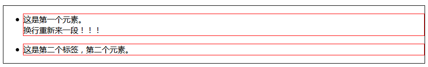
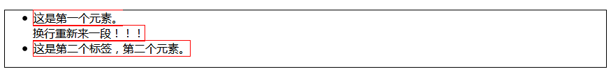
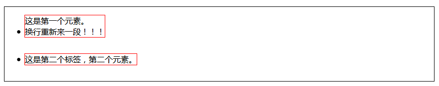
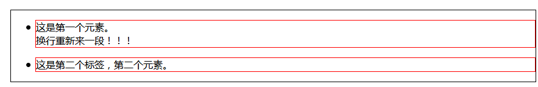
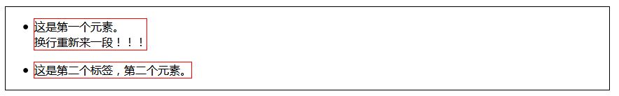
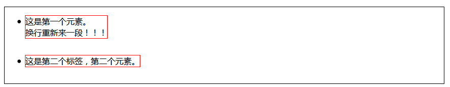

在盒子模型中每个盒子都可以被用于不同的显示方式，其中控制显示方式的属性是**display**。如同<**tab**>和<**p**>其显示的方式是有很大区别的，我们可以通过display来进行盒子显示方式的改变。
<!--more-->

# display 属性值


属性值:
----
|值  | 描述|
|:-----|:-------|
|**none**  | 此元素不会被显示。|
|**block**  | 此元素将显示为块级元素，此元素前后会带有换行符。|
|**inline**  | 默认。此元素会被显示为内联元素，元素前后没有换行符。|
|**inline-block**  | 行内块元素。（CSS2.1 新增的值）。|
|**list-item**  | 此元素会作为列表显示。|
|run-in  | 此元素会根据上下文作为块级元素或内联元素显示。|
|~~compact~~  | ~~CSS 中有值 compact，不过由于缺乏广泛支持，已经从 CSS2.1 中删除。~~|
|~~marker~~  | ~~CSS 中有值 marker，不过由于缺乏广泛支持，已经从 CSS2.1 中删除。~~|
|**table**  | 此元素会作为块级表格来显示（类似 &lt;table>），表格前后带有换行符。|
|**inline-table**  | 此元素会作为内联表格来显示（类似 &lt;table>），表格前后没有换行符。|
|table-row-group  | 此元素会作为一个或多个行的分组来显示（类似 &lt;tbody>）。|
|table-header-group  | 此元素会作为一个或多个行的分组来显示（类似 &lt;thead>）。|
|table-footer-group  | 此元素会作为一个或多个行的分组来显示（类似 &lt;tfoot>）。|
|table-row  | 此元素会作为一个表格行显示（类似 &lt;tr>）。|
|table-column-group  | 此元素会作为一个或多个列的分组来显示（类似 &lt;colgroup>）。|
|table-column  | 此元素会作为一个单元格列显示（类似 &lt;col>）。|
|table-cell  | 此元素会作为一个表格单元格显示（类似 &lt;td>和 &lt;th>）。|
|table-caption  | 此元素会作为一个表格标题显示（类似 &lt;caption>）。|
|inherit  | 规定应该从父元素继承 display 属性的值。|

*常用的用加粗表示*

# display 实例
代码样本：
```html
<html>

<head>
    <meta charset="utf-8">
    <title>测试display属性值</title>
    <style>
		body{border: 1px solid;}
        p {
            border: 1px solid red;
            display: <属性值>; <!--测试几个常用的值-->
            
        }
    </style>
</head>

<body>

    <ul>
        <li>
            <p>这是第一个元素。
                <br> 换行重新来一段！！！
            </p>
        </li>
        <li>
            <p>这是第二个标签，第二个元素。</p>
        </li>
    </ul>
</body>

</html>
```
## block

样式：


## inline

样式：


## inline-block

样式：


## list-item

样式：


## table

样式：


## inline-table

样式：

