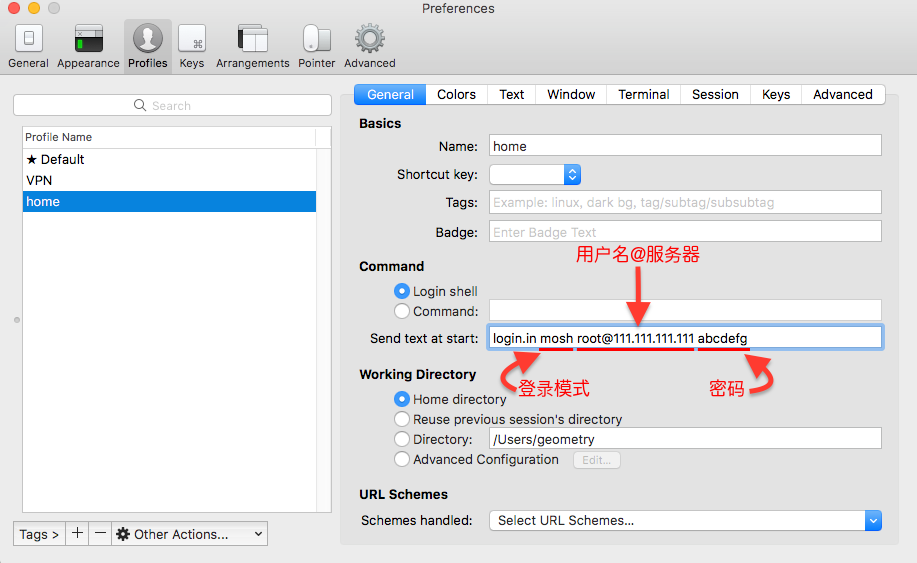

Windows上有xshell可以进行远程主机管理，但是mac和linux上没有这种软件，我们可以采用脚本的方式进行登录。

# 设置自动远程登录

也可以使用密钥进行登录，但本文采取的方案是expect脚本的方式。

## 不通过跳板机进行登录

1、 写一个expect脚本
```bash
#!/usr/bin/expect  
  
set timeout 30  
spawn [lindex $argv 0] [lindex $argv 1]
expect {  
        "(yes/no)?"  
        {send "yes\n";exp_continue}  
        "password:"  
        {send "[lindex $argv 2]\n"}  
}  
interact  
```
该脚本比较简单，需要三个参数，第一个参数是选择ssh连接还mosh连接，第二个参数是 用户名@远程地址，第三个参数是密码。

2、 将expect脚本copy到$PATH下（例如/usr/local/bin）

3、 在iterm2中设置登录命令为1中的脚本，用command+o的方式呼出profiles，点击Edit Profiles


如上图配好后，即可自动登录

## 跳板机进行登录

下面再说下有跳板机的情况
不同公司的环境不一样，也许某些同学可以进行参考

1. 跳板机上不能存放任何文件，/tmp下可以方临时文件，每天会定时清掉。
2. copy文件方向只能是local->跳板机->remote的方向，即local可以push/pull跳板机上的文件，跳板机可以push/pull远程上的文件。
3. 向跳板机登录前需要通过邮件/短信的方式获取passcode，这是除密码之外的额外的验证方式
其实跳板机的自动远程登录与非跳板机的差异在expect脚本的编写上，其他的照搬即可，那这里就直接把代码贴出来就行了。

```bash
#!/usr/bin/expect  
  
  
# 参数1：远程host；参数2：远程password    
if { $argc != 2 } {  
    send_user "Usage: host password\n"  
    exit  
}  
  
set host [lindex $argv 0]  
set pw [lindex $argv 1]  
  
set TERMSERV yourjumpserver # 跳板机服务器  
set USER jumpserveruser # 用户名  
set PASSWORD jumperserverpasswd # 跳板机密码  
  
  
set fd [open /place/to/passcode r] # 本地存放passcode的地方  
gets $fd pc  
close $fd  
  
  
# Start the session  
catch {spawn ssh -l $USER $TERMSERV} # 登录跳板机  
  
# Login  
expect "*assword:*" { send "$PASSWORD\r" }  
expect "*passcode:*" { send "$pc\r" }   
  
  
#通过跳板机登录线上机器  
expect "*hostname*" { send "ssh -l $USER $host\r" } # hostname为你跳板机的名字  
expect {  
    "(yes/no)?"  
    {send "yes\n";exp_continue}  
    "*assword:*"  
    {send "$pw\n"}  
}  
expect "*$host*" { send "cd ~\r"; interact }
```