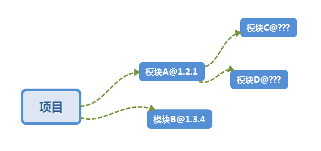

Yarn是Facebook公司出品的用于管理nodejs包的一款软件，开发过nodejs的同学应该知道，我们一般都使用npm作为我们nodejs项目的模块管理器，但npm有一些历史遗留问题，首先，npm安装速度比较慢，而且当项目中模块数量越来越多时，管理这些模块及其依赖的版本是件令人头疼的事，其次npm在模块安装的过程中可以执行程序，安全性不高。yarn的存在正好解决了这些问题，模块安装速度简直快的令人发指，当某些模块通过yarn安装过后，再次安装甚至不需要连接网络；yarn也可以很好的控制模块依赖的版本（通过yarn.lock文件锁住），而且安全可靠。

<!--more-->

# yarn和npm

## yarn 介绍

facebook发布的新一代包管理工具，旨在解决以往使用npm作为包管理会遇到的一些问题。从其官方介绍可以看到其重点强调的3个点：快、可靠、安全。

yarn拥有以下6个特性：

* 离线模式: 一次安装，永久使用，无需下载。
* 依赖确定性：安装依赖锁定，保证一致性。
* 更好的网络性能：下载包，优化网络请求，最大限度提高网络利用率。
* 多注册来源处理：不管依赖包被不同的库间接关联引用多少次，安装这个包时，只会从一个注册来源去装(npm/bower), 防止出现混乱不一致。
* 网络弹性处理: 安装依赖时，不会因为某个单次网络请求的失败导致整个安装挂掉。当请求失败时会进行自动重试。
* 扁平模式: 当关联依赖中包括对某个软件包的重复引用，在实际安装时将尽量避免重复的创建。

**yarn.lock文件**解决了npm存在一些历史遗留问题：

比如说你的项目模块依赖是图中描述的，@1.2.1代表这个模块的版本。在你安装A的时候需要安装依赖C和D，很多依赖不会指定版本号，默认会安装最新的版本，这样就会出现问题：比如今天安装模块的时候C和D是某一个版本，而当以后C、D更新的时候，再次安装模块就会安装C和D的最新版本，如果新的版本无法兼容你的项目，你的程序可能就会出BUG，甚至无法运行。这就是npm的弊端，而yarn为了解决这个问题推出了yarn.lock的机制，这是作者项目中的yarn.lock文件。

## 安装方法

yarn可以通过npm直接安装：
`npm install -g yarn`

## 使用方法

首先，yarn 的全局安装并不是加 -g 或者 --global 这样的参数，它使用 `yarn global` 命令。用 `yarn global --help` 可以看到子命令列表。

Usage: `yarn global [add|bin|ls|remove|upgrade] [flags]`
这些子命令的用法和非 global 的同名命令用法差不多。

* npm install === yarn / yarn install
* npm install xxx —save === yarn add xxx
* npm uninstall xxx —save === yarn remove xxx
* npm install xxx —save-dev === yarn add xxx —dev
* npm update === yarn upgrade
* npm install xxx -g === yarn global add xxx
* yarn list，根据当前项目的package.json查看模块的依赖及版本。
* yarn info koa，查看koa模块的详细信息，类似于npm view koa。
* yarn init，初始化项目package.json文件，等同于npm init。
* yarn run，运行package.json中的script。

yarn还有很多有用的命令，很简单，可以通过`yarn help`获取帮助信息。

# 源的选择

npm安装插件过程：从http://registry.npmjs.org下载对应的插件包（该网站服务器位于国外，所以经常下载缓慢或出现异常）。

cnpm和cyarn是解决nodejs源下载速度太慢的一个解决方案。

http://npm.taobao.org 是淘宝团队做的一个镜像网站，这是一个完整 npmjs.org 镜像，你可以用此代替官方版本(只读)，同步频率目前为10分钟一次以保证尽量与官方服务同步。
源地址： https://registry.npm.taobao.org

## 安装cnpm和cyarn

* cnpm：
`npm install cnpm -g --registry=https://registry.npm.taobao.org`
或者使用 cnpm 源：
`npm install cnpm -g`

注： _"--registry=https://registry.npm.taobao.org"_ 是临时使用源https://registry.npm.taobao.org 进行下载。

* cyarn：
`npm install -g cyarn`
或者使用 cnpm 源：
`npm install -g cyarn --registry=https://registry.npm.taobao.org`

# 其他修改源的方式

* 配置config
`yarn config set registry https://registry.npm.taobao.org`
`npm config set registry https://registry.npm.taobao.org`

* 查看当前源
`npm config get registry`
