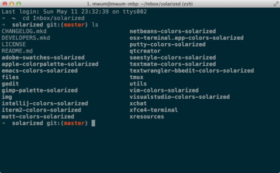
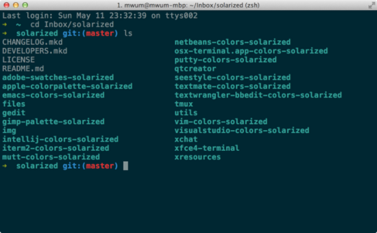
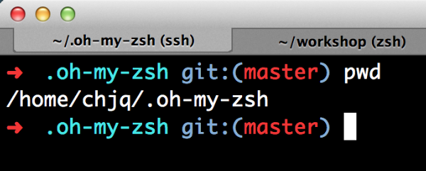

mac电脑的终端自动补全很是有问题，现在可以使用zsh来进行终端操作。

<!--more-->


参考内容： 
http://www.tuicool.com/articles/FFN7Vbq 
https://zhuanlan.zhihu.com/p/19556676?columnSlug=mactalk


# iTerm2

iTerm 2 is a terminal emulator for Mac OS X that does amazing things.
iTerm2 是一个终端模拟器，官方网站： http://www.iterm2.com/

## 修改主题后出现问题

终端灰蒙蒙的，就像下面这样：


下面我们来回到彩色世界：
依次打开 iTerm2 - Profiles - Edit Profiles - Profiles - Text - Text Rendering，将 Draw bold text in bright colors 前面的勾去掉。

彩色的世界就回来了


## 有意思的配置

* 快捷键呼出 Preferences - Keys - Hotkey - Hotkey toggles a dedicated window with profile 把它设置成 Hotkey Window，按快捷键之后 Hotkey Window 会从屏幕上面折叠下来
* 菜单栏中的 Window 还有一些有趣的东西，比如保存读取窗口快照
* Preferences - Profiles - Terminal - Terminal Emulation - Report Terminal Type 将其中的 xterm 改成 xterm-256color，比如在 Vim 显示一些配色方案会好很多
* 复用上个会话的目录 Preferences - Profiles - Working Directory - Reuse previous session’s directory

## 快捷键

* ⌘ + Click ：可以打开文件，文件夹和链接
* ⌘ + n ：新建窗口
* ⌘ + t ：新建标签页
* ⌘ + w ：关闭当前页
* ⌘ + 数字 & ⌘ + 方向键 ：切换标签页
* ⌥⌘ + 数字 ：切换窗口
* ⌘ + enter ：切换全屏
* ⌘ + d ：左右分屏
* ⇧⌘ + d ：上下分屏
* ⌘ + ; ：自动补全历史记录
* ⇧⌘ + h ：自动补全剪贴板历史
* ⌥⌘ + e ：查找所有来定位某个标签页
* ⌘ + r & ⌃ + l ：清屏
* ⌘ + / ：显示光标位置
* ⌥⌘ + b ：历史回放
* ⌘ + f ：查找，然后用 tab 和 ⇧ + tab 可以向右和向左补全，补全之后的内容会被自动复制， 还可以用 ⌥ + enter 将查找结果输入终端
* 选中即复制，鼠标中键粘贴

很多快捷键都是通用的，和 Emace 等都是一样的

* ⌃ + u ：清空当前行
* ⌃ + a ：移动到行首
* ⌃ + e ：移动到行尾
* ⌃ + f ：向前移动
* ⌃ + b ：向后移动
* ⌃ + p ：上一条命令
* ⌃ + n ：下一条命令
* ⌃ + r ：搜索历史命令
* ⌃ + y ：召回最近用命令删除的文字
* ⌃ + h ：删除光标之前的字符
* ⌃ + d ：删除光标所指的字符
* ⌃ + w ：删除光标之前的单词
* ⌃ + k ：删除从光标到行尾的内容
* ⌃ + t ：交换光标和之前的字符

还有鼠标和触摸板控制Preferences - Pointer

# zsh

Shell是Linux/Unix的一个外壳，你理解成衣服也行。它负责外界与Linux内核的交互，接收用户或其他应用程序的命令，然后把这些命令转化成内核能理解的语言，传给内核，内核是真正干活的，干完之后再把结果返回用户或应用程序。

Linux/Unix提供了很多种Shell，为毛要这么多Shell？难道用来炒着吃么？那我问你，你同类型的衣服怎么有那么多件？花色，质地还不一样。写程序比买衣服复杂多了，而且程序员往往负责把复杂的事情搞简单，简单的事情搞复杂。牛程序员看到不爽的Shell，就会自己重新写一套，慢慢形成了一些标准，常用的Shell有这么几种，sh、bash、csh等，想知道你的系统有几种shell，可以通过以下命令查看：

`cat /etc/shells`

显示如下：

```bash
/bin/bash
/bin/csh
/bin/ksh
/bin/sh
/bin/tcsh
/bin/zsh
```

在 Linux 里执行这个命令和 Mac 略有不同，你会发现 Mac 多了一个 zsh，也就是说 OS X 系统预装了个 zsh，这是个神马 Shell 呢？

目前常用的 Linux 系统和 OS X 系统的默认 Shell 都是 bash，但是真正强大的 Shell 是深藏不露的 zsh， 这货绝对是马车中的跑车，跑车中的飞行车，史称『终极 Shell』，但是由于配置过于复杂，所以初期无人问津，很多人跑过来看看 zsh 的配置指南，什么都不说转身就走了。直到有一天，国外有个穷极无聊的程序员开发出了一个能够让你快速上手的zsh项目，叫做「oh my zsh」，Github 网址是：https://github.com/robbyrussell/oh-my-zsh。这玩意就像「X天叫你学会 C++」系列，可以让你神功速成，而且是真的。

## 安装zsh

Mac，执行：`brew install zsh`
Redhat Linux，执行：`sudo yum install zsh`
Ubuntu Linux，执行：`sudo apt-get install zsh`

安装完成后设置当前用户使用 zsh ,执行：`chsh -s /bin/zsh`
根据提示输入当前用户的密码就可以了。

_注：brew 全称是 Homebrew ，可以安装 Apple 没有预装但你需要的东西。macOS 的软件包管理器。在终端运行`/usr/bin/ruby -e "$(curl -fsSL https://raw.githubusercontent.com/Homebrew/install/master/install)"` 安装 Homebrew。_

## zsh使用

1. 兼容 bash，原来使用 bash 的兄弟切换过来毫无压力，该咋用咋用。

2. 强大的历史纪录功能，输入 grep 然后用上下箭头可以翻阅你执行的所有 grep 命令。

3. 智能拼写纠正，输入`gtep mactalk * -R`，系统会提示：`zsh: correct ‘gtep’ to ‘grep’ [nyae]?` 比妹纸贴心吧，她们向来都是让你猜的……

4. 各种补全：路径补全、命令补全，命令参数补全，插件内容补全等等。触发补全只需要按一下或两下 tab 键，补全项可以使用 ctrl+n/p/f/b 上下左右切换。
比如你想杀掉 java 的进程，只需要输入 `kill java + tab键` ，如果只有一个 java 进程，zsh 会自动替换为进程的 pid，如果有多个则会出现选择项供你选择。
`ssh + 空格 + 两个tab键` ，zsh会列出所有访问过的主机和用户名进行补全。

5. 智能跳转，安装了autojump之后，zsh 会自动记录你访问过的目录。
通过 j + 目录名 可以直接进行目录跳转，而且目录名支持模糊匹配和自动补全。
例如你访问过hadoop-1.0.0目录，输入 `j hado` 即可正确跳转。
`j –stat` 可以看你的历史路径库。

6. 目录浏览和跳转：输入 `d` ，即可列出你在这个会话里访问的目录列表，输入列表前的序号，即可直接跳转。

7. 在当前目录下输入 `..` ，或直接输入当前目录名都可以跳转，不再需要输入 cd 命令了。

8. 通配符搜索：`ls -l **/*.sh` ，可以递归显示当前目录下的 shell 文件。
文件少时可以代替 find，文件太多就歇菜了。

9. 更强的别名：请参考 oh my zsh>配置 一节。

10. 插件支持：请参考 oh my zsh>插件 一节。

# oh my zsh

安装「oh my zsh」可以自动安装也可以手动安装。

## 安装

* 自动安装：
`wget https://github.com/robbyrussell/oh-my-zsh/raw/master/tools/install.sh -O - | sh`

* 手动安装：
`git clone git://github.com/robbyrussell/oh-my-zsh.git ~/.oh-my-zsh`
`cp ~/.oh-my-zsh/templates/zshrc.zsh-template ~/.zshrc`

都不复杂，安装完成之后退出当前会话重新打开一个终端窗口，你就可以见到这个彩色的提示了：


## 配置

zsh 的配置主要集中在用户当前目录的 .zshrc 里，用 vim 或你喜欢的其他编辑器打开.zshrc，在最下面会发现这么一行字：
```conf
> # Customize to your needs…
```
可以在此处定义自己的环境变量和别名，当然，oh my zsh 在安装时已经自动读取当前的环境变量并进行了设置，你可以继续追加其他环境变量。

接下来进行别名的设置，我自己的部分配置如下：

```bash
#alias j='autojump'
alias cls='clear'
alias ll='ls -la'
alias la='ls -a'
alias vi='vim'
alias javac="javac -J-Dfile.encoding=utf8"
alias grep="grep --color=auto"
alias hp="http_proxy=http://localhost:8123" #polipo 代理上网
alias -s html=mate   # 在命令行直接输入后缀为 html 的文件名，会在 TextMate 中打开
alias -s rb=mate     # 在命令行直接输入 ruby 文件，会在 TextMate 中打开
alias -s py=python3  # 在命令行直接输入 python 文件，会用 vim 中打开，以下类似
alias -s js=nodejs
alias -s js=vi
alias -s c=vi
alias -s java=vi
alias -s txt=vi
alias -s gz='tar -xzvf'
alias -s tgz='tar -xzvf'
alias -s zip='unzip'
alias -s bz2='tar -xjvf'
```

zsh 不仅可以设置通用别名，还能针对文件类型设置对应的打开程序，比如：

`alias -s html=mate`
意思就是你在命令行输入 hello.html，zsh 会为你自动打开 TextMat 并读取 hello.html；

`alias -s gz='tar -xzvf'`
表示自动解压后缀为 gz 的压缩包。

总之，只有想不到，木有做不到。

设置完环境变量和别名之后，基本上就可以用了。

## 主题

如果你是个主题控，还可以玩玩 zsh 的主题。在 `.zshrc` 里找到ZSH_THEME，就可以设置主题了，默认主题是：

`ZSH_THEME=”robbyrussell”`

oh my zsh 提供了数十种主题，相关文件在 `~/.oh-my-zsh/themes` 目录下，你可以随意选择，也可以编辑主题满足自己的需求，我采用了默认主题robbyrussell，不过做了一点小小的改动：

```bash
PROMPT='%{$fg_bold[red]%}➜ %{$fg_bold[green]%}%p%{$fg[cyan]%}%d %{$fg_bold[blue]%}$(git_prompt_info)%{$fg_bold[blue]%}% %{$reset_color%}>'
#PROMPT='%{$fg_bold[red]%}➜ %{$fg_bold[green]%}%p %{$fg[cyan]%}%c %{$fg_bold[blue]%}$(git_prompt_info)%{$fg_bold[blue]%} % %{$reset_color%}'
```

对照原来的版本，我把 c 改为 d，c 表示当前目录，d 表示绝对路径，另外在末尾增加了一个「 > 」。

##### 主题推荐
* `ys` 　　　　　　　　　　 *#推荐* 
* `agnoster` 


## 插件

oh my zsh 项目提供了完善的插件体系，相关的文件在`~/.oh-my-zsh/plugins`目录下，默认提供了100多种，大家可以根据自己的实际学习和工作环境采用。想了解每个插件的功能，只要打开相关目录下的 zsh 文件看一下就知道了。
`~/.oh-my-zsh//custom/plugins` 添加用户自己的插件。
插件在`.zshrc`里配置，找到plugins关键字，你就可以加载自己的插件了，系统默认加载 git ，你可以在后面追加内容，如下：

`plugins=(git textmate ruby autojump osx mvn gradle)`

下面简单介绍几个：

1. **git：**当你处于一个 git 受控的目录下时，Shell 会明确显示 「git」和 branch，如上图所示，另外对 git 很多命令进行了简化。
例如 gco=’git checkout’、gd=’git diff’、gst=’git status’、g=’git’等等，熟练使用可以大大减少 git 的命令长度。
命令内容可以参考 `~/.oh-my-zsh/plugins/git/git.plugin.zsh`。

2. **textmate：**mr可以创建 ruby 的框架项目，tm finename 可以用 textmate 打开指定文件。

3. **osx：**tab 增强，quick-look filename 可以直接预览文件，man-preview grep 可以生成 grep手册 的pdf 版本等。

4. **autojump：**zsh 和 autojump 的组合形成了 zsh 下最强悍的插件，今天我们主要说说这货。

5. **sudo：**在指令的最前面按两下 ESC 加入 sudo 。不用再移动光标到头部了，sudo就会自动加入到最前面。

6. **zsh-syntax-highlighting：**可以在zsh中进行语法高亮。
https://github.com/zsh-users/zsh-syntax-highlighting


github上整理出来了很多的插件：
[awesome-zsh-plugins](https://github.com/unixorn/awesome-zsh-plugins)

### autojump

首先安装autojump，如果你用 Mac，可以使用 brew 安装：

`brew install autojump`

如果是 Linux，去下载 autojump 的最新版本，比如：

`wget https://github.com/downloads/joelthelion/autojump/autojump_v21.1.2.tar.gz`

解压缩后进入目录，执行

`./install.sh`

最后把以下代码加入 `.zshrc`

`[[ -s ~/.autojump/etc/profile.d/autojump.sh ]] && . ~/.autojump/etc/profile.d/autojump.sh`

至此，安装、配置、插件三位一体，终极 Shell 全面登场。退出终端会话重新登录，开始感受 zsh 的训疾如风！

#tmux

官网： http://tmux.github.io/
一个终端复用软件，可将终端方案化。

## tmux安装

使用brew就可以安装：
`brew install tmux`

## tmux配置

配置文件在：
`mvim ~/.tmux.conf`

经常连接服务器用起来应该挺好用的。
比如，在一个窗口中分隔成多个终端同时运行不同的命令。
使用 SSH 的时候，在网络不稳定的情况下，可保存工作环境。
在网络不好的环境下，可以尝试使用 `Mosh` 来代替 SSH 。

# 问题汇总

## vim无法打开文件

删除以.zcompdump-开头的文件

```bash
rm -rf ~/.zcompdump-*
exec zsh
```

